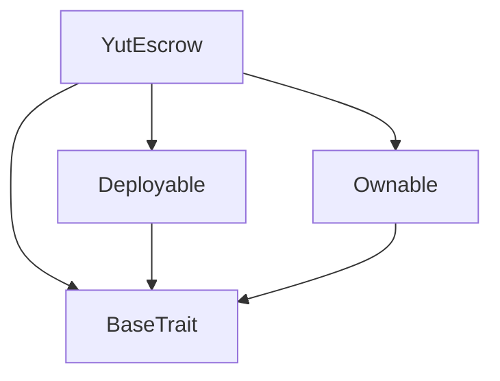
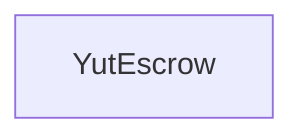

# Tact compilation report
Contract: YutEscrow
BoC Size: 2338 bytes

## Structures (Structs and Messages)
Total structures: 21

### DataSize
TL-B: `_ cells:int257 bits:int257 refs:int257 = DataSize`
Signature: `DataSize{cells:int257,bits:int257,refs:int257}`

### SignedBundle
TL-B: `_ signature:fixed_bytes64 signedData:remainder<slice> = SignedBundle`
Signature: `SignedBundle{signature:fixed_bytes64,signedData:remainder<slice>}`

### StateInit
TL-B: `_ code:^cell data:^cell = StateInit`
Signature: `StateInit{code:^cell,data:^cell}`

### Context
TL-B: `_ bounceable:bool sender:address value:int257 raw:^slice = Context`
Signature: `Context{bounceable:bool,sender:address,value:int257,raw:^slice}`

### SendParameters
TL-B: `_ mode:int257 body:Maybe ^cell code:Maybe ^cell data:Maybe ^cell value:int257 to:address bounce:bool = SendParameters`
Signature: `SendParameters{mode:int257,body:Maybe ^cell,code:Maybe ^cell,data:Maybe ^cell,value:int257,to:address,bounce:bool}`

### MessageParameters
TL-B: `_ mode:int257 body:Maybe ^cell value:int257 to:address bounce:bool = MessageParameters`
Signature: `MessageParameters{mode:int257,body:Maybe ^cell,value:int257,to:address,bounce:bool}`

### DeployParameters
TL-B: `_ mode:int257 body:Maybe ^cell value:int257 bounce:bool init:StateInit{code:^cell,data:^cell} = DeployParameters`
Signature: `DeployParameters{mode:int257,body:Maybe ^cell,value:int257,bounce:bool,init:StateInit{code:^cell,data:^cell}}`

### StdAddress
TL-B: `_ workchain:int8 address:uint256 = StdAddress`
Signature: `StdAddress{workchain:int8,address:uint256}`

### VarAddress
TL-B: `_ workchain:int32 address:^slice = VarAddress`
Signature: `VarAddress{workchain:int32,address:^slice}`

### BasechainAddress
TL-B: `_ hash:Maybe int257 = BasechainAddress`
Signature: `BasechainAddress{hash:Maybe int257}`

### Deploy
TL-B: `deploy#946a98b6 queryId:uint64 = Deploy`
Signature: `Deploy{queryId:uint64}`

### DeployOk
TL-B: `deploy_ok#aff90f57 queryId:uint64 = DeployOk`
Signature: `DeployOk{queryId:uint64}`

### FactoryDeploy
TL-B: `factory_deploy#6d0ff13b queryId:uint64 cashback:address = FactoryDeploy`
Signature: `FactoryDeploy{queryId:uint64,cashback:address}`

### ChangeOwner
TL-B: `change_owner#819dbe99 queryId:uint64 newOwner:address = ChangeOwner`
Signature: `ChangeOwner{queryId:uint64,newOwner:address}`

### ChangeOwnerOk
TL-B: `change_owner_ok#327b2b4a queryId:uint64 newOwner:address = ChangeOwnerOk`
Signature: `ChangeOwnerOk{queryId:uint64,newOwner:address}`

### CreateGame
TL-B: `create_game#6ead1d33 roomCode:uint64 betAmount:coins playerCount:uint8 = CreateGame`
Signature: `CreateGame{roomCode:uint64,betAmount:coins,playerCount:uint8}`

### Deposit
TL-B: `deposit#b0d37ea6 roomCode:uint64 = Deposit`
Signature: `Deposit{roomCode:uint64}`

### SettlePayout
TL-B: `settle_payout#2122392f roomCode:uint64 winner1:address winner2:address winner3:address winner4:address winnerCount:uint8 = SettlePayout`
Signature: `SettlePayout{roomCode:uint64,winner1:address,winner2:address,winner3:address,winner4:address,winnerCount:uint8}`

### Refund
TL-B: `refund#a62c7809 roomCode:uint64 = Refund`
Signature: `Refund{roomCode:uint64}`

### GameData
TL-B: `_ betAmount:coins playerCount:uint8 depositCount:uint8 gameActive:bool settled:bool createdAt:uint32 totalDeposited:coins player1:address player2:address player3:address player4:address deposit1:bool deposit2:bool deposit3:bool deposit4:bool = GameData`
Signature: `GameData{betAmount:coins,playerCount:uint8,depositCount:uint8,gameActive:bool,settled:bool,createdAt:uint32,totalDeposited:coins,player1:address,player2:address,player3:address,player4:address,deposit1:bool,deposit2:bool,deposit3:bool,deposit4:bool}`

### YutEscrow$Data
TL-B: `_ owner:address games:dict<int, ^GameData{betAmount:coins,playerCount:uint8,depositCount:uint8,gameActive:bool,settled:bool,createdAt:uint32,totalDeposited:coins,player1:address,player2:address,player3:address,player4:address,deposit1:bool,deposit2:bool,deposit3:bool,deposit4:bool}> platformFeeRate:uint16 = YutEscrow`
Signature: `YutEscrow{owner:address,games:dict<int, ^GameData{betAmount:coins,playerCount:uint8,depositCount:uint8,gameActive:bool,settled:bool,createdAt:uint32,totalDeposited:coins,player1:address,player2:address,player3:address,player4:address,deposit1:bool,deposit2:bool,deposit3:bool,deposit4:bool}>,platformFeeRate:uint16}`

## Get methods
Total get methods: 3

## gameData
Argument: roomCode

## platformFeeRate
No arguments

## owner
No arguments

## Exit codes
* 2: Stack underflow
* 3: Stack overflow
* 4: Integer overflow
* 5: Integer out of expected range
* 6: Invalid opcode
* 7: Type check error
* 8: Cell overflow
* 9: Cell underflow
* 10: Dictionary error
* 11: 'Unknown' error
* 12: Fatal error
* 13: Out of gas error
* 14: Virtualization error
* 32: Action list is invalid
* 33: Action list is too long
* 34: Action is invalid or not supported
* 35: Invalid source address in outbound message
* 36: Invalid destination address in outbound message
* 37: Not enough Toncoin
* 38: Not enough extra currencies
* 39: Outbound message does not fit into a cell after rewriting
* 40: Cannot process a message
* 41: Library reference is null
* 42: Library change action error
* 43: Exceeded maximum number of cells in the library or the maximum depth of the Merkle tree
* 50: Account state size exceeded limits
* 128: Null reference exception
* 129: Invalid serialization prefix
* 130: Invalid incoming message
* 131: Constraints error
* 132: Access denied
* 133: Contract stopped
* 134: Invalid argument
* 135: Code of a contract was not found
* 136: Invalid standard address
* 138: Not a basechain address
* 3983: Invalid player count
* 5721: Already settled
* 19483: Game not active
* 29159: Game already settled
* 41723: Game not found
* 43107: Insufficient deposit amount
* 43440: Cannot deposit: slots full or already deposited
* 43773: Bet amount must be positive
* 51321: Game already exists
* 60655: Invalid winner count

## Trait inheritance diagram

## Contract dependency diagram

